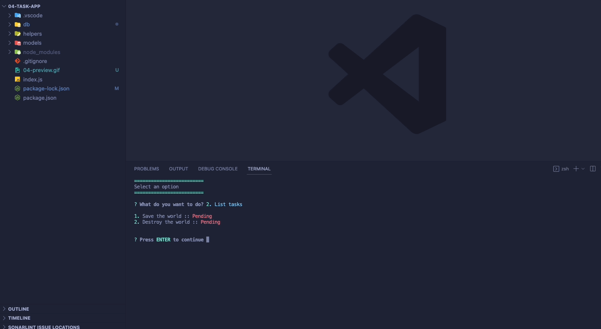
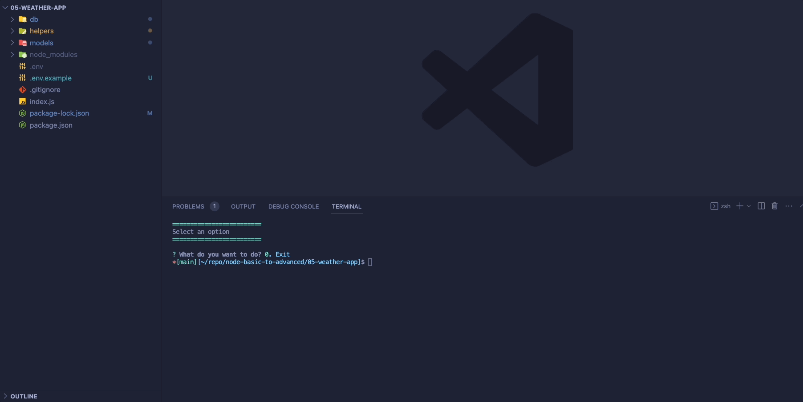
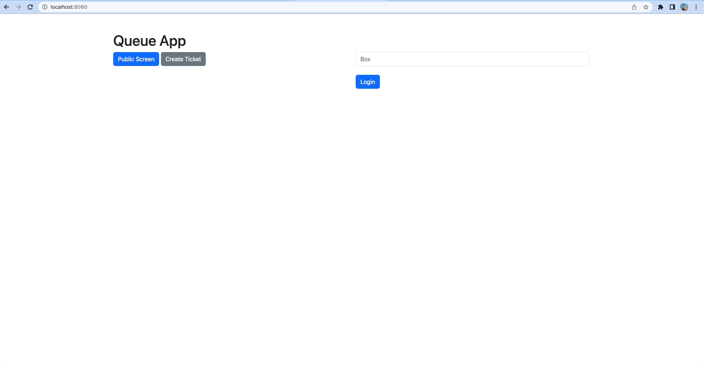
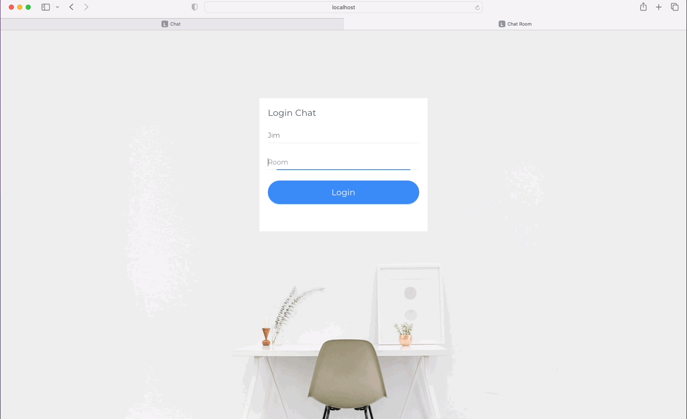

# NodeJS from fundamentals to advance concepts

This project contains different applications in nodejs. Ranging from a simple hello world to rest server, socket server, web server applications.

## Applications

- [1. Hello World](./01-hello-world)
- [2. Fundamentals](./02-fundamentals)
- [3. Node Table](./03-node-table)
- [4. Tasks App (Console)](./04-task-app)

- [5. Weather App (Console)](./05-weather-app)

- [6. Web Server](./06-web-server)
- [7. Rest Server](./07-rest-server)
- [8. Socket Server](./08-websocket-server)
- [9. Socket Queue (Web App)](./09-socket-queue)

- [10. Socket Chat V1](./10-socket-chat)
- [11. Rest Server with TS](./11-rest-server-ts)
- [12. Socket Chat V2](./12-chat-server-v2)

## Installation

On each application make sure to run `npm install`

## Usage

Verify the `scripts` on the `package.json` file
